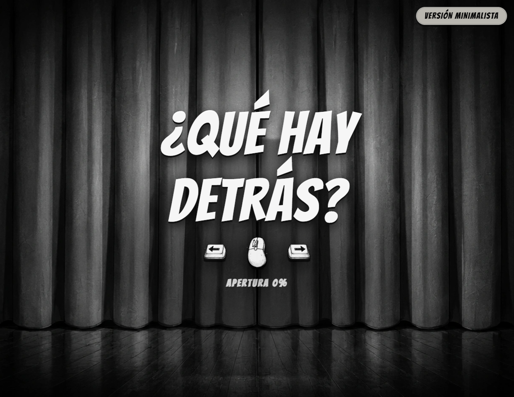
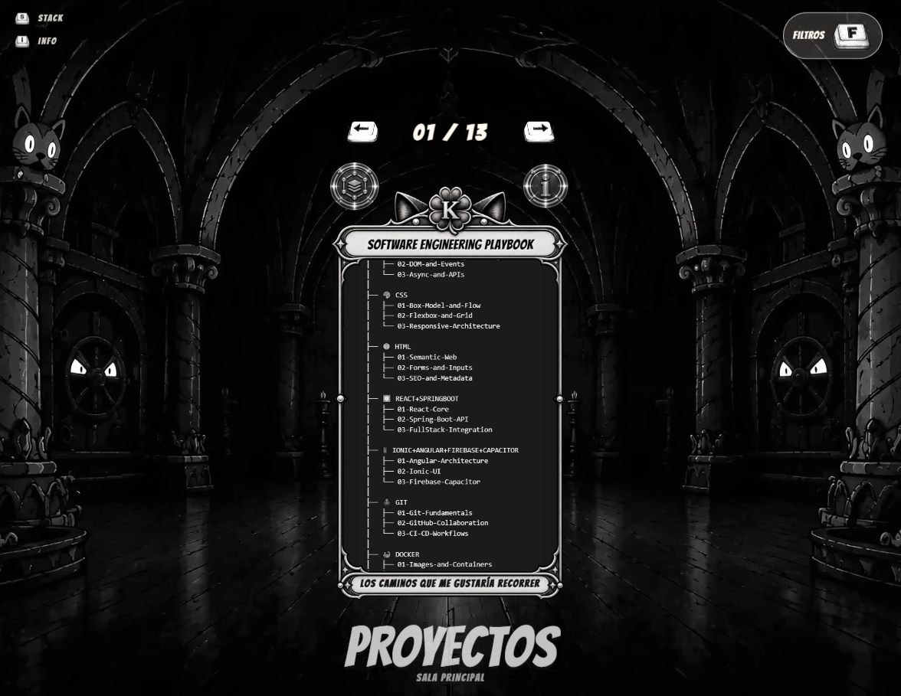
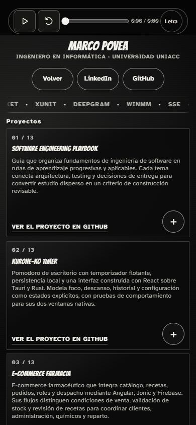

# Kurone Ko Portfolio

This cinematic portfolio brings together my work as a developer: products,
experiments, and ideas transformed into purposeful software.

<p align="center">
  
</p>

## Highlights

- **More than a project gallery:** A guided experience designed to make the work memorable.
- **Two exploration routes:** Move through the cinematic story or go directly to the showcase.
- **Real interaction and accessibility:** Progression, controls, keyboard access, and responsive behavior are part of the work.
- **One portfolio spanning different challenges:** Products, experiments, and ideas share one purposeful surface.

## Explore the Portfolio

<p align="center">
  
</p>

<p align="center">
  
</p>

Desktop and mobile views carry the same intent through different compositions.

## How I Build

- **Structure systems around what is likely to change:** Keep feature-local interface, accessibility, and content together; keep business rules independent of framework APIs; use ports and adapters only for replaceable storage, OS services, or providers.
- **Treat failure paths as product behavior:** Invalid progression resets safely, protected routes reject skipped steps, media has a fallback, and autoplay remains under user control.
- **Build accessibility into the interaction model:** Keyboard and touch input, focus, semantic announcements, reduced motion, responsive layouts, and no-JavaScript fallback are designed into the experience.
- **Turn decisions into executable evidence:** Focused unit tests, boundary integration tests, and browser journeys keep each change scoped around one behavior, with implementation and tests together so intent and impact can be reviewed independently without reconstructing or obstructing unrelated work.

## Portfolio Stack

Next.js 16, React 19, TypeScript, CSS, and Tailwind CSS 4.

Verification uses Vitest, Testing Library, and Playwright.

## Run Locally

```bash
pnpm install --frozen-lockfile
pnpm dev
```

## License

This portfolio and its contents are **ALL RIGHTS RESERVED**. Public visibility does not grant permission to copy, modify, distribute, or reuse this work. The complete terms are defined in **LICENSE**.

<p align="center">
  <a href="LICENSE">
    
  </a>
</p>
